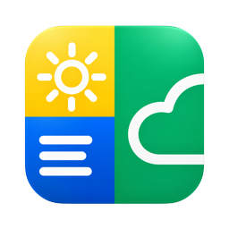
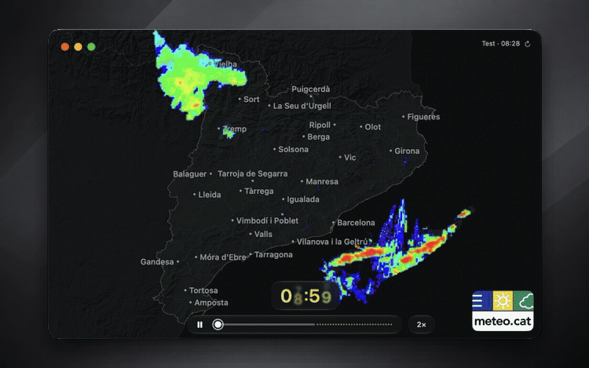

<p align="center">
  
</p>

<h1 align="center">Meteocat</h1>

<p align="center">
  A native weather radar viewer for Catalonia.<br>
  Built for macOS with SwiftUI and AppKit.
</p>

<p align="center">
  <strong>macOS 14+</strong> &nbsp; · &nbsp; <strong>Light & Dark</strong> &nbsp; · &nbsp; <strong>21 languages</strong>
</p>

<p align="center">
  <a href="#features">Features</a> &nbsp; · &nbsp;
  <a href="#build-and-run">Build & Run</a> &nbsp; · &nbsp;
  <a href="#data-and-attribution">Data & Attribution</a>
</p>

---

Meteocat brings the rainfall radar from the **Servei Meteorològic de Catalunya** to your Mac. Play through observations and forecasts, explore the map, and keep the viewer within reach from the Dock, menu bar, or a global keyboard shortcut.

This project was inspired by [RadarCat](https://github.com/pmontp19/radarcat) by [pmontp19](https://github.com/pmontp19).

It was built out of the belief that a publicly funded weather service should offer a good native desktop experience for the people whose taxes support it.

<p align="center">
  
</p>

<p align="center"><sub>Dark appearance · 2× playback · Recorded radar data from October 7, 2026.</sub></p>

## Features

- **Radar playback.** A chronological timeline of observations and forecasts, with smooth transitions and adjustable playback speed.
- **An interactive map.** Zoom, pan, and choose which cities appear. Add your own locations or mark a point on the map.
- **Native macOS windows.** Resize the viewer, use full screen, and restore its saved position and size.
- **Your preferred appearance.** Light, Dark, or Automatic, which follows macOS. Automatic is the default.
- **Quick access.** Choose Dock and menu bar visibility and configure a global show/hide shortcut.
- **21 languages.** Switch languages instantly in Settings or follow your system preference.

Settings always opens at General. Fixed keyboard shortcuts are listed under **Help → Keyboard Shortcuts**; source credits are available under **About Meteocat → Sources**.

## Install from the DMG

Download **Meteocat-1.0.1.dmg** from the [latest release](https://github.com/mguellsegarra/meteocat/releases/latest), open it, and drag **Meteocat.app** to **Applications**. The downloadable build requires **macOS 14 or later on Apple Silicon**.

### First launch: macOS security warning

**This build is ad hoc signed and has not been notarized by Apple.** macOS may block the first launch with a message saying it could not verify that Meteocat is free of malware. You must explicitly allow the app on your Mac; installing it from the DMG does not grant this permission automatically.

Only proceed if you trust the downloaded copy. To allow it using [Apple's documented procedure](https://support.apple.com/102445):

1. Open **Meteocat** from Applications once, then dismiss the warning with **Done**.
2. Open **System Settings → Privacy & Security** and scroll down to **Security**.
3. Click **Open Anyway** next to the message about Meteocat.
4. Confirm the opening and authenticate if prompted. macOS saves an exception for this app so you can open it normally afterward.

Alternatively, after copying the app to Applications, you can remove its quarantine attribute in Terminal:

```sh
xattr -dr com.apple.quarantine "/Applications/Meteocat.app"
```

This command applies only to Meteocat and its contents. It removes the quarantine attribute; it does not check the app for malware, sign it with Developer ID, or notarize it. Use it only for a copy you trust, then open Meteocat from Applications.

## Build and run

The app runs on **macOS 14 or later**. Building requires a recent Xcode toolchain with the **macOS 26 SDK or later**, including the availability-gated Liquid Glass APIs. The package declares Swift tools 5.9 and has no remote Swift Package Manager dependencies.

```sh
swift build --product Meteocat
swift run Meteocat
```

Normal launches use live weather data. To run entirely offline with the bundled recorded data:

```sh
swift run Meteocat --fixture
```

You can also supply a compatible capture directory:

```sh
swift run Meteocat --fixture /path/to/capture
```

It must contain `active.json`, `snapshot-info.json`, and the tile images referenced by the manifest. Recorded mode uses the capture's original timestamp; it does not represent current weather.

### Package a macOS app

```sh
bash Scripts/package-app.sh
```

This creates **`Artifacts/Meteocat.app`**. The destination must not already exist. To choose a different destination:

```sh
bash Scripts/package-app.sh /path/to/Meteocat.app
```

The script builds in Release mode, verifies resources after relocating the app away from its build directory, checks all localizations and the property list, and applies an ad hoc signature. It does not launch or notarize the app.

## Keyboard shortcuts

With the radar viewer focused:

| Action | Shortcut |
| --- | --- |
| Play or pause | Space |
| Previous or next frame | ← / → |
| Show or hide cities | L |
| Refresh data | ⌘R |
| Increase / decrease / reset viewer size | ⌘+ / ⌘− / ⌘0 |
| Open Settings | ⌘, |

The global shortcut is editable in **Settings → General**.

## Development

```sh
swift test
python3 Scripts/verify-localizations.py
```

Tests use recorded fixtures and injected HTTP clients; they make no live weather requests. To check a packaged app's translations and location permission resources:

```sh
python3 Scripts/verify-localizations.py --app /path/to/Meteocat.app
```

Native window interaction, accessibility, and live weather behavior also require testing in the running app.

| Directory | Purpose |
| --- | --- |
| `Sources/MeteocatApp/` | AppKit windows, SwiftUI views, map interaction, and playback |
| `Sources/MeteocatCore/` | Metadata, raster images, projection, cache, and settings |
| `Sources/FixtureImport/` | Local fixture import, auditing, and resource verification |
| `Tests/` | Core and app behavior tests |
| `Assets/` | App icon and README image |
| `Scripts/` | Packaging, localization checks, and geography preparation |

See [the architecture notes](Design/architecture.md) for the technical contracts. Compiled apps and local development artifacts are excluded from Git; recorded test fixtures and their provenance are retained.

## Languages

Catalan, Aranese, Spanish, Basque, Galician, English, French, German, Italian, Portuguese, Dutch, Romanian, Arabic, Standard Moroccan Tamazight, Urdu, Simplified Chinese, Ukrainian, Russian, Polish, Punjabi, and Bengali.

Choose a language in **Settings → General → Language**. The change applies immediately to app text and dates, with Catalan as the fallback. Settings follows the language's writing direction; the radar keeps its geographic layout. Dates use the Gregorian calendar and the Europe/Madrid time zone, while stored frame timestamps remain UTC.

Translations still benefit from review by native speakers, particularly Tamazight.

## Disclaimer

This is an independent, non-commercial project developed without a profit motive. It is not affiliated with, endorsed by, or an official product of the Servei Meteorològic de Catalunya (Meteocat) or the Generalitat de Catalunya.

The app retrieves radar information from Meteocat's public radar webpage and image endpoints to display it in a native macOS interface. It is intended as a convenient way to consult that information, as you would on the radar website. This does not imply permission to reuse or redistribute the underlying data: [Meteocat's terms of use](https://www.meteo.cat/wpweb/avis-legal/) and the rights of each data provider still apply. Names, logos, and weather data remain the property of their respective owners.

The app is provided "as is", without warranties of accuracy, completeness, availability, or fitness for a particular purpose. Data may be delayed, incomplete, or unavailable. Use it for general information, and consult official forecasts, warnings, and emergency guidance for safety decisions. To the extent permitted by applicable law, the author and contributors accept no liability for misuse, misinterpretation, or loss or damage arising from use of the app. Users remain responsible for how they use it.

## Data and attribution

Radar data comes from [Meteocat](https://www.meteo.cat). Map boundaries come from [ICGC](https://www.icgc.cat) under CC BY 4.0, geographic context from [Natural Earth](https://www.naturalearthdata.com), municipality data from Idescat, and terrain from [Mapzen Terrain Tiles](https://registry.opendata.aws/terrain-tiles/).

The app's **Sources** window includes the full terrain attribution. Source manifests in [`Sources/MeteocatCore/Resources/Geography/`](Sources/MeteocatCore/Resources/Geography/) record origins, hashes, and attribution. Keep these with the data. Bundled radar fixtures do not imply permission to redistribute the source data.

Settings and the radar cache are stored locally at:

```text
~/Library/Application Support/cat.marc.meteocat-native/
```

This historical directory is retained for compatibility. The current app bundle identifier is `cat.mguellsegarra.meteocat`. Location lookup runs only when requested; saved coordinates stay on your Mac and are not sent to the radar service.
